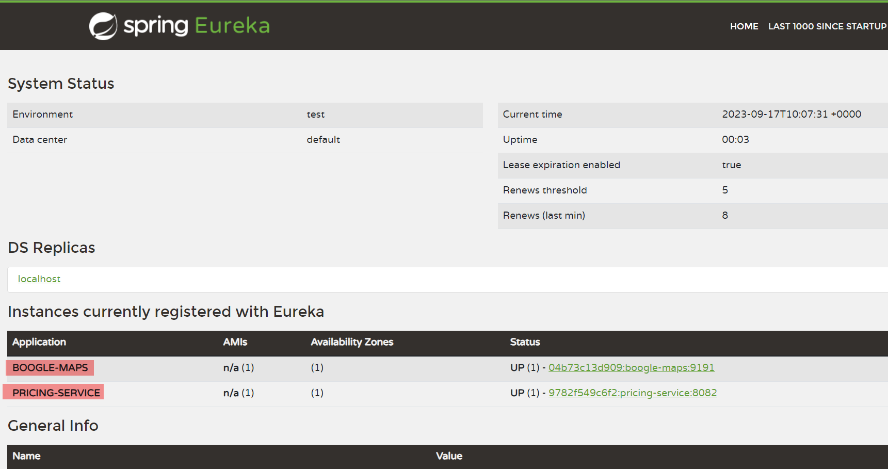

# VehiclesAPI-Project

Implement a Vehicles API using **Java** and **Spring Boot** that can communicate with separate *location* and *pricing* services.

### 4 Separate Sub-Projects

1. [Pricing Service](pricing-service/README.md): A microservice that provides APIs to access a specific vehicle.
2. [Boogle Maps](boogle-maps/README.md): A microservice that provides APIs to access the location of a specific vehicle.
3. [Eureka Server](./eureka-server/README.md): A service registry that allows Boogle Maps and Pricing service to register themselves
4. [Vehicles API](vehicles-api/README.md): A REST API to maintain vehicle data and to provide a complete view of vehicle details including price and address.

### Purposes

Understand how to implement a **REST API** application in Spring Boot; How to create a **service registry** and convert a REST service into a **microservice** using **Netflix's Eureka** that has been integrated into Spring Cloud.

### Results

1. Dashboard of Eureka service registry

_Boogle Maps and Pricing services registered successfully to the service registry_

2. Vehicles API application consumes 2 services Boogle Maps and Pricing above, and it provides APIs that we can try a test at [API DOCS here](http://159.65.133.69/swagger-ui.html) that are temporary documented with **Swagger** tool. 

**Note:** You can simply modify [this template](https://github.com/rdavdin/vehicles_api/tree/main/vehicles-api#create-a-vehicle) to create a vehicle.
